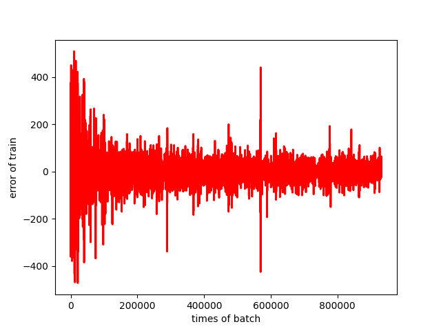

### ***This Repository stores the homework answer of HungYi Lee MACHING LEARNING(2020).***

I intend to use Python & PyTorch to deal the homework,of course in the first two assignments,I will use numpy replace PyTorch.And I will explain my own thinking in the README for every assignment.

# ***First assignment***
### <b>Description of the problem</b>
[the link of assignment](https://docs.google.com/presentation/d/18MG1wSTTx8AentGnMfIRUp8ipo8bLpgAj16bJoqW-b0/edit#slide=id.g4cd6560e29_0_10) 
In the context of the problem,the content of 18 substances in the atmosphere will affect the concentration of PM2.5.given,the content of these 18 substances in the atmosphere in the first eight hours,we need manual achieve linear regression to forecast the PM2.5 of next hour. 
### <b>Data preprocessing</b>
- Due to the problem of the data character encoding set, we changed all Chinese in the data to English, but this did not affect the results of our model training.
- The'NR' in the data indicates that there was NO RAIN on this day. Considering that the features input to the model are all floating-point data,so we transform 'NR' to zero. 
### <b>Model</b>
we assume the function set as follow:  
1.***y=b+W1X.*** 
2.***y=b+W1X+W2X2.*** 
3.***y=b+W1X+W2X2+W3X3.*** 
the Y represents the predicted value of PM2.5,X is the input feature,Xijindicates the content of the i-th substance in the atmosphere at the t-th time.

### <b>Result</b>
the model 1:
***y=b+W1X.*** 
when the learning_rate=0.00001,empoch=1,error during training：

